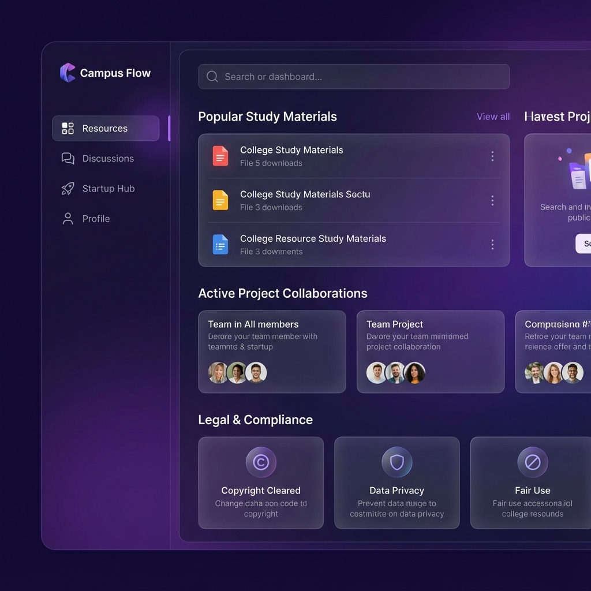

# ⚡ Samir Pandey - Full Stack Developer Portfolio

 
*(Note: Replace with a screenshot of your actual portfolio home page if available, currently using a placeholder)*

A high-performance, visually stunning, and fully responsive personal portfolio website built with modern web technologies. This project showcases my skills, experience, and projects wrapped in an interactive and sleek user interface.

## 🚀 Features

-   **✨ Interactive Animations**: Immersive experience powered by **Framer Motion** and **GSAP**.
-   **📱 Fully Responsive**: Flawless layout across all devices - from large desktops to mobile phones.
-   **⚡ Optimized Performance**:
    -   **Throttled Event Listeners**: Smooth scrolling without jank.
    -   **Lazy Loading**: Images load only when needed for lightning-fast initial render.
    -   **Mobile Optimizations**: Heavy animations are intelligently disabled on smaller screens to save battery and resources.
-   **🎨 Modern UI/UX**: Designed with **Tailwind CSS** featuring glassmorphism, glowing gradients, and a cohesive dark theme.
-   **🔍 SEO Ready**: Fully configured meta tags and Open Graph data for social sharing.

## 🛠️ Tech Stack

-   **Frontend Framework**: [React.js](https://reactjs.org/) (Vite)
-   **Styling**: [Tailwind CSS](https://tailwindcss.com/)
-   **Animations**:
    -   [Framer Motion](https://www.framer.com/motion/) (Layout & Interactive animations)
    -   [GSAP](https://greensock.com/gsap/) (Scroll-triggered effects)
-   **Icons**: [Lucide React](https://lucide.dev/)
-   **Deployment**: [Netlify](https://www.netlify.com/) (Recommended)

## 📂 Project Structure

```bash
src/
├── components/         # Reusable UI components (Navbar, Cards, etc.)
│   ├── nurui/          # Custom complex UI elements (Gradient Grid, etc.)
│   └── section/        # Main page sections (Hero, Projects, Skills, etc.)
├── lib/                # Utility functions
├── assets/             # Static assets
└── App.jsx             # Main application entry
```

## 🚀 Getting Started

1.  **Clone the repository**
    ```bash
    git clone https://github.com/samirpandey-07/my-portfolio.git
    cd my-portfolio
    ```

2.  **Install dependencies**
    ```bash
    npm install
    ```

3.  **Run the development server**
    ```bash
    npm run dev
    ```

4.  **Build for production**
    ```bash
    npm run build
    ```

## 📫 Contact

-   **Name**: Samir Pandey
-   **LinkedIn**: [Samir Pandey](https://linkedin.com/in/samir-pandey) *(Update with your actual link if different)*
-   **Email**: [Your Email] *(Update this)*

---

*Built with ❤️ by Samir Pandey*
